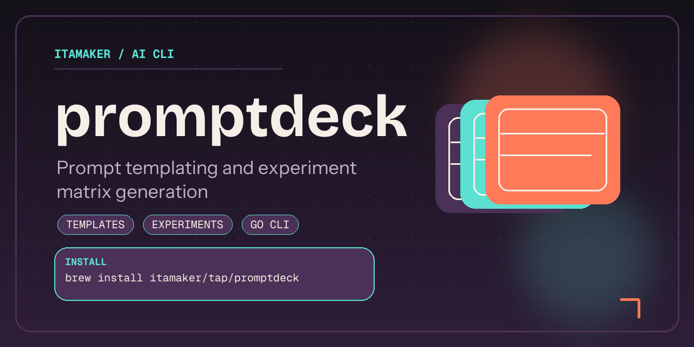

# promptdeck

[](#contributors-)

`promptdeck` is a Go CLI for rendering, batching, and optimizing prompt templates.

It helps teams turn small JSON files into prompt variants, experiment manifests, and score-driven prompt rankings without relying on spreadsheets or heavyweight prompt platforms.



## Support

[](https://buymeacoffee.com/amaker)

## Quickstart

### Install

```bash
brew install itamaker/tap/promptdeck
```

<details>
<summary>You can also download binaries from <a href="https://github.com/itamaker/promptdeck/releases">GitHub Releases</a>.</summary>

Current release archives:

- macOS (Apple Silicon/arm64): `promptdeck_0.2.0_darwin_arm64.tar.gz`
- macOS (Intel/x86_64): `promptdeck_0.2.0_darwin_amd64.tar.gz`
- Linux (arm64): `promptdeck_0.2.0_linux_arm64.tar.gz`
- Linux (x86_64): `promptdeck_0.2.0_linux_amd64.tar.gz`

Each archive contains a single executable: `promptdeck`.

</details>

### First Run

Run:

```bash
promptdeck
```

This launches the interactive Bubble Tea terminal UI.

You can still use the direct command form:

```bash
promptdeck matrix -template examples/review.tmpl -matrix examples/matrix.json
```

Then rank variants from an experiment score file:

```bash
promptdeck optimize -template examples/review.tmpl -matrix examples/matrix.json -scores examples/scores.json
```

## Requirements

- Go `1.22+`

## Run

Render one prompt:

```bash
go run . render -template examples/review.tmpl -vars examples/vars.json
```

Render a matrix:

```bash
go run . matrix -template examples/review.tmpl -matrix examples/matrix.json
```

Write a manifest for later analysis:

```bash
go run . matrix -template examples/review.tmpl -matrix examples/matrix.json -manifest /tmp/prompts.json
```

Optimize prompt variants from scored runs:

```bash
go run . optimize -template examples/review.tmpl -matrix examples/matrix.json -scores examples/scores.json
```

## Build From Source

```bash
make build
```

```bash
go build -o dist/promptdeck .
```

## What It Does

1. Loads Go text templates from local files.
2. Renders one prompt from a JSON variable object or many prompts from a JSON array.
3. Expands matrix inputs into Cartesian prompt combinations.
4. Emits prompt manifests for experiment tracking.
5. Ranks prompt candidates from scored runs and reports the strongest variable settings.
6. Prints output to stdout or writes prompt batches to files.

## Notes

- Use `-out-dir` when you want prompt variants as individual files.
- Maintainer release steps live in `PUBLISHING.md`.

## Contributors ✨

| [![Zhaoyang Jia][avatar-zhaoyang]][author-zhaoyang] |
| --- |
| [Zhaoyang Jia][author-zhaoyang] |


[author-zhaoyang]: https://github.com/itamaker
[avatar-zhaoyang]: https://images.weserv.nl/?url=https://github.com/itamaker.png&h=120&w=120&fit=cover&mask=circle&maxage=7d

## License

[MIT](LICENSE)
